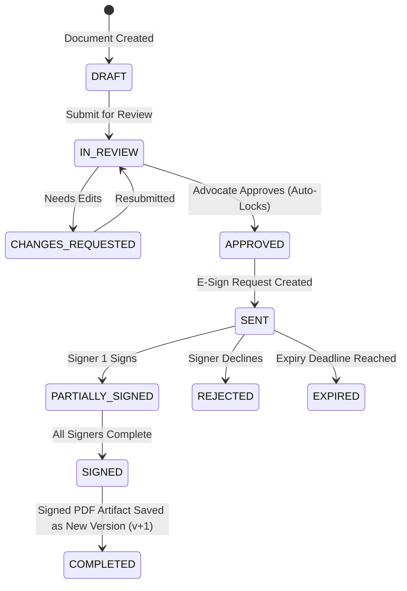

# Legal Electronic Signature (E-Sign) Integration Guide

## 1. Executive Summary & Statutory Framework

The Legal Practice Management Platform provides a modular, pluggable electronic signature system designed specifically for Indian legal operations, client agreements, vakalatnamas, and court filings.

### Statutory Validity in India
Electronic signatures executed through this platform are architected to comply with:
- **Information Technology Act, 2000 (Section 3A, Section 10A, Section 65B)**: Legal recognition of electronic records and electronic signatures.
- **Indian Evidence Act, 1872 (Section 65B)**: Admissibility of electronic records and tamper-evident audit trails with SHA-256 cryptographic hashes.
- **Aadhaar eSign Regulations (UIDAI / CCA)**: Integration with licensed Certifying Authorities (CAs) and Application Service Providers (ASPs) such as Digio and Leegality.

> [!IMPORTANT]
> In compliance with professional ethics and statutory standards, **unapproved drafts cannot be dispatched for e-signature**. Only documents in `APPROVED` workflow status can initiate an e-signature request.

---

## 2. Architecture & Provider Abstraction

The e-signature engine is built on an extensible abstract provider pattern (`ESignProvider`), allowing zero-downtime switching between providers without modifying business logic.

```
                  ┌─────────────────────────────────┐
                  │    documentSignatureService     │
                  └───────────────┬─────────────────┘
                                  │ (resolves provider)
                                  ▼
                  ┌─────────────────────────────────┐
                  │      esignProviderFactory       │
                  └───────────────┬─────────────────┘
                                  │
         ┌────────────────────────┼────────────────────────┐
         ▼                        ▼                        ▼
┌──────────────────┐    ┌──────────────────┐    ┌──────────────────┐
│  DigioProvider   │    │ LeegalityProvider│    │MockESignProvider │
│   (Digio v2)     │    │  (Leegality API) │    │(Simulated Audit) │
└──────────────────┘    └──────────────────┘    └──────────────────┘
```

### Base Interface: `ESignProvider` (`server/providers/esign/ESignProvider.js`)

All providers implement the following asynchronous lifecycle methods:
1. `createSignatureRequest({ document, signers, expiresAt, callbackUrl, firmId })`: Initiates an e-sign request with the external gateway.
2. `getSignatureStatus(externalRequestId)`: Polls or fetches the current status of signers and document completion.
3. `downloadSignedDocument(externalRequestId)`: Retrieves the cryptographically sealed PDF artifact as a binary buffer.
4. `cancelSignatureRequest(externalRequestId, reason)`: Revokes the signing workflow.
5. `verifyWebhookSignature(payload, signatureHeader, secret)`: Validates HMAC-SHA256 signature on inbound webhook callbacks.

---

## 3. Supported Providers

### 1. Digio Provider (`server/providers/esign/DigioProvider.js`)
- **Gateway**: Digio v2 API (`ext.digio.in` / `api.digio.in`).
- **Authentication**: HTTP Basic Auth with `ESIGN_DIGIO_CLIENT_ID` and `ESIGN_DIGIO_CLIENT_SECRET`.
- **Workflow Modes**: Aadhaar eSign, Electronic Signature (eSign), or Virtual Sign.
- **Signer Mapping**: Maps sequential signing orders and signer coordinates or anchor tags.

### 2. Leegality Provider (`server/providers/esign/LeegalityProvider.js`)
- **Gateway**: Leegality API (`sandbox.leegality.com` / `api.leegality.com`).
- **Authentication**: Custom Header Auth with `X-Auth-Token: ESIGN_LEEGALITY_AUTH_TOKEN`.
- **Workflow Modes**: Aadhaar eSign, Document Stamping (digital stamp duty), DSC (Digital Signature Certificate Token).
- **Multi-Party**: Supports sequential order or parallel signing invite workflows.

### 3. Mock Provider (`server/providers/esign/MockESignProvider.js`)
- **Default for Local Development & Automated CI Testing**:
  - Requires zero external API credentials.
  - Generates realistic mock request IDs (e.g. `DID-MOCK-1726140000000-A1B2C3D4`).
  - Simulates signing links (`http://localhost:5173/mock-esign/sign?id=...`).
  - Emits real binary PDF 1.4 artifacts sealed with SHA-256 digital certificates and audit logs on completion.

---

## 4. Multi-Signer Lifecycle & State Machine



### Signature Request Database Structure
- `document_signature_requests`:
  - `id`: Auto-increment primary key.
  - `document_id`: Target document link.
  - `version_id`: Target immutable version link.
  - `provider`: `DIGIO`, `LEEGALITY`, or `MOCK`.
  - `external_request_id`: Provider reference key.
  - `status`: `DRAFT`, `SENT`, `PARTIALLY_SIGNED`, `COMPLETED`, `DECLINED`, `EXPIRED`, `CANCELLED`.
  - `signing_order`: `SEQUENTIAL` vs `PARALLEL`.
  - `expires_at`: Expiration timestamp.
- `document_signature_signers`:
  - `request_id`: Foreign key.
  - `signer_name`, `signer_email`, `signer_phone`: Signer identity.
  - `signer_role`: `CLIENT`, `ADVOCATE`, `OPPOSING_PARTY`, `WITNESS`.
  - `order_index`: Integer index for sequential workflows.
  - `status`: `PENDING`, `NOTIFIED`, `VIEWED`, `SIGNED`, `REJECTED`, `EXPIRED`.
  - `signed_at`: Timestamp of signature execution.
  - `ip_address`: Signer IP recorded for Section 65B compliance.
  - `audit_trail`: JSON object capturing verification method, certificate serial, and timestamps.

---

## 5. Webhook Integration & Security

Webhooks allow instant notification when signers complete or reject documents.

### Endpoint
- **URL**: `POST /api/v1/webhooks/esign/:provider` (e.g. `/api/v1/webhooks/esign/digio`, `/api/v1/webhooks/esign/leegality`, `/api/v1/webhooks/esign/mock`)
- **Authentication**: Validated using provider-specific HMAC-SHA256 signature headers (`x-digio-signature` or `x-leegality-signature`) against `ESIGN_WEBHOOK_SECRET`.

### Webhook Event Handling Rules
1. **Idempotency Protection**: Duplicate webhook deliveries are ignored if the transaction or signer is already recorded as signed.
2. **Sequential Progression**: When a signer completes in `SEQUENTIAL` mode, the provider automatically dispatches the signing invitation to the next signer in `order_index`.
3. **Artifact Generation & Immutability**:
   - When all signers reach `SIGNED`, the system calls `provider.downloadSignedDocument()`.
   - The signed PDF is hashed (SHA-256) and saved to storage as a new document version (e.g., `v2`).
   - The document's `status` transitions to `SIGNED`.
   - The document is permanently locked (`is_locked = 1`).

---

## 6. Environment Configuration

Add the following variables to `.env` to configure e-sign providers:

```env
# E-Signature Provider Configuration
ESIGN_DEFAULT_PROVIDER=MOCK               # Options: MOCK | DIGIO | LEEGALITY
ESIGN_WEBHOOK_SECRET=your-hmac-webhook-secret-key

# Digio Production / Sandbox Credentials
ESIGN_DIGIO_CLIENT_ID=your_digio_client_id
ESIGN_DIGIO_CLIENT_SECRET=your_digio_client_secret
ESIGN_DIGIO_SANDBOX=true

# Leegality Production / Sandbox Credentials
ESIGN_LEEGALITY_AUTH_TOKEN=your_leegality_token
ESIGN_LEEGALITY_SANDBOX=true
```

---

## 7. Testing E-Signatures

Run the comprehensive e-signature automated test suite:

```bash
node server/tests/document_esign_test.js
```

This tests:
1. Protection against e-signing unapproved drafts (400 validation).
2. Approval by advocate & transition to `APPROVED`.
3. Dispatching multi-party signature request with sequential order.
4. Simulating webhook execution for Signer 1 (`PARTIALLY_SIGNED`).
5. Simulating webhook execution for Signer 2 (`COMPLETED`).
6. Creation of signed immutable PDF version `v2` with cryptographic SHA-256 hash.
7. Verification of signed PDF binary retrieval.
